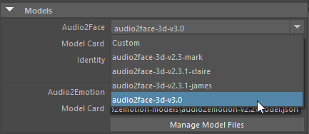
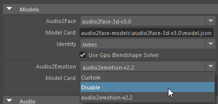

# Quickstart

This guide will help you get started with Maya ACE from the sample scenes. Please follow the steps below to get started.

## Table of Contents

- [Sample Scene with Audio2Face-3D Local Inference](#sample-scene-with-audio2face-3d-local-inference)
- [Sample Scene with Audio2Face-3D Service](#sample-scene-with-audio2face-3d-service)

## Sample Scene with Audio2Face-3D Local Inference

### Prepare for the use of Audio2Face-3D Local Inference

1. [Install the Plugin](prerequisites.md#install-the-plugin)
2. [Download the Sample Project](prerequisites.md#download-the-sample-project)
3. [Download AI Models](prerequisites.md#download-ai-models)
4. [Build TRT Engines](prerequisites.md#build-trt-engines)

### Configure Maya and Set Project

1. Launch Maya and set the **project** to the [sample project](../sample_project) directory
 
    - Open Maya and select `File -> Set Project`
    - Select the sample project directory
    - Click `OK`

2. Disable `Cached Playback` on the Time Slider
 
    - Maya-ACE v2.0+ works with Cached Playback, but it is recommended to disable this feature during initial testing.

### Open the Full Face A2F Sample Scene

1. Open one of the [sample Maya scenes](../sample_project/README.md#scenes). For example, [james_v3_fullface.ma](../sample_project/scenes/james_v3_fullface.ma).
     
    - This may take a few moments to load the scene and TRT engines. Once the face shows up and [the green line at the bottom of the time slider](userinterface.md#compute-status---timeslider-color) is filled, the scene is ready to play.

2. Check and adjust [Time Slider preferences](https://help.autodesk.com/view/MAYAUL/2024/ENU/?guid=GUID-51A80586-9EEA-43A4-AA1F-BF1370C24A64): framerate=**60**, playback speed=**60fps x 1**, looping=once
 

3. Select the `A2FAnimationPlayer1` node and open the Attribute Editor
    - Tip 1: You can expand `AnimationPlayerSet` on the outliner and then select `A2FAnimationPlayer1`.
     
    - Tip 2: To open the Attribute Editor, click menu -> Windows -> General Editors -> Attribute Editor
     

4. (Optional) If audio is not imported properly, [Import audio into the Maya scene](https://help.autodesk.com/view/MAYAUL/2024/ENU/?guid=GUID-CF2B0358-6946-4C9D-9F8C-A783921CAECC)
    1. Set it to the Time Slider sound
     
    1. Set it to the A2FAnimationPlayer1 node
     

5. (Optional) If face does not show up, select `Audio2Face-3D v3.0` and `Audio2Emotion v2.2` models under Models option.
     

6. (Optional) If you are in a region where Audio2Emotion is not available, please change the Audio2Emotion model to `Disable`.
     

7. Click Maya's play button. Watch how the face moves.
 

## Sample Scene with Audio2Face-3D Service

### Prepare for the Audio2Face-3D Service access through Maya

1. [Install the Plugin](prerequisites.md#install-the-plugin)
2. [Download the Sample Project](prerequisites.md#download-the-sample-project)
3. [Prepare Access to the Service](prerequisites.md#prepare-access-to-the-service)

### Configure Maya and Set Project

1. Launch Maya and set the **project** to the [sample project](../sample_project) directory
 
    - Open Maya and select `File -> Set Project`
    - Select the sample project directory
    - Click `OK`

2. Disable `Cached Playback` on the Time Slider
 
    - Maya-ACE v2.0+ works with Cached Playback, but it is recommended to disable this feature during initial testing.

### Open the Blendshape ACE Sample Scene

1. Open the sample scene:
[sample_project/scenes/ace_v2_arkit.ma](../sample_project/scenes/ace_v2_arkit.ma).
 

2. Check and adjust [Time Slider preferences](https://help.autodesk.com/view/MAYAUL/2024/ENU/?guid=GUID-51A80586-9EEA-43A4-AA1F-BF1370C24A64): framerate=30, playback speed=30fps x 1, looping=once
 

3. Select the `AceAnimationPlayer1` node and open the Attribute Editor
    - Tip 1: You can expand `AnimationPlayerSet` on the outliner and then select `AceAnimationPlayer1`.
     
    - Tip 2: To open the Attribute Editor, click menu -> Windows -> General Editors -> Attribute Editor
     

4. (Optional) If audio is not imported properly, [Import audio into the Maya scene](https://help.autodesk.com/view/MAYAUL/2024/ENU/?guid=GUID-CF2B0358-6946-4C9D-9F8C-A783921CAECC)
    1. Set it to the Time Slider sound
     
    1. Set it to the ACEAnimationPlayer1 node
     

5. Click the `Request New Animation` button and wait for the **Received ### frames** message.
 

6. The circle on the right of the button will change color to green if the communication was successful.

7. Click Maya's play button. Watch how the face is moving.
 
