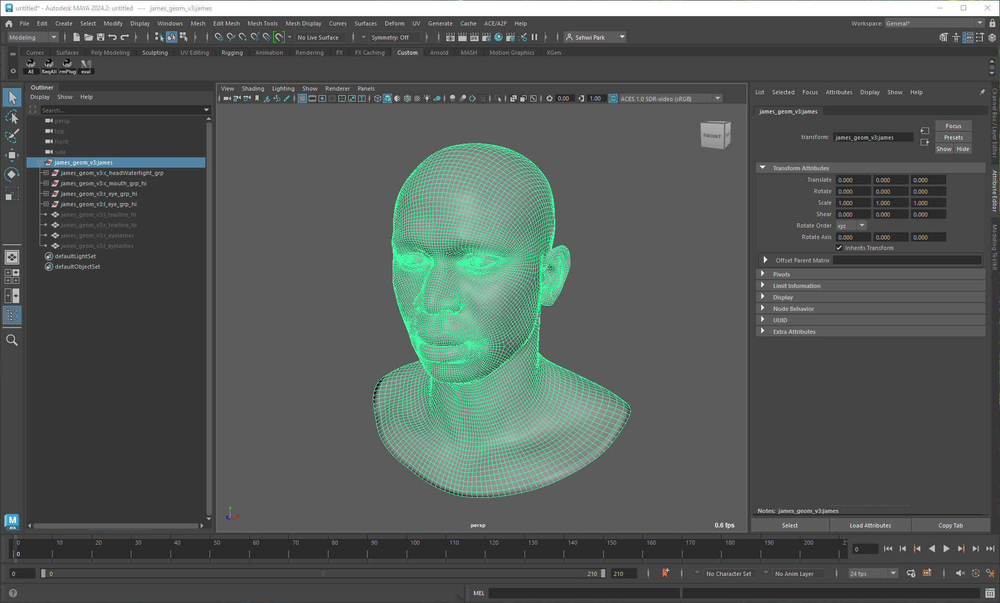
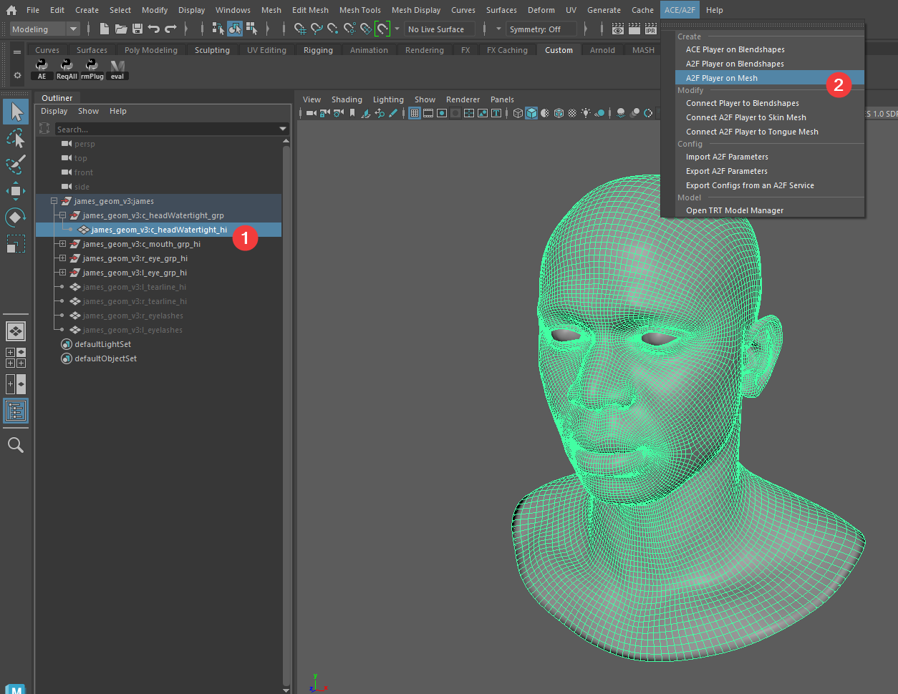
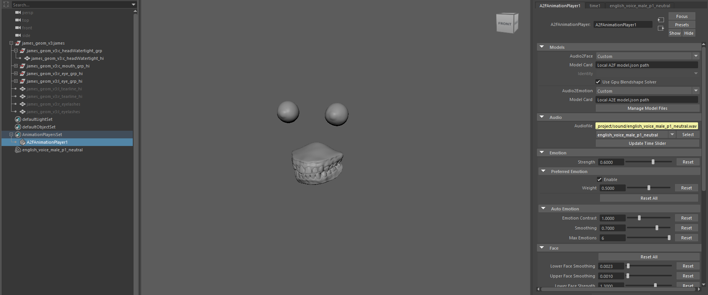
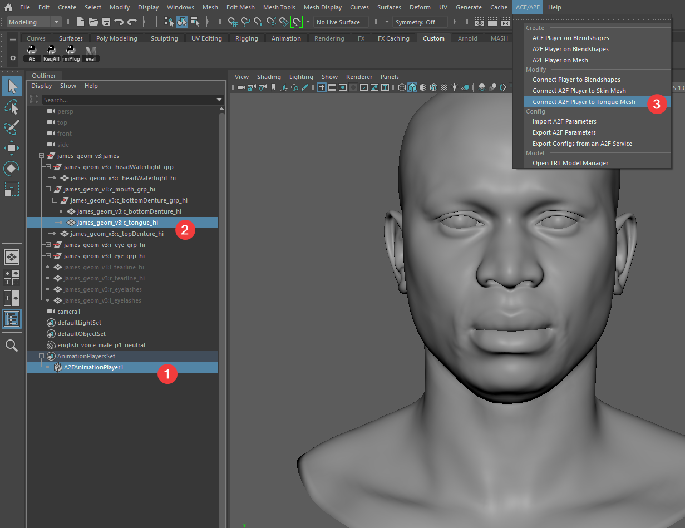
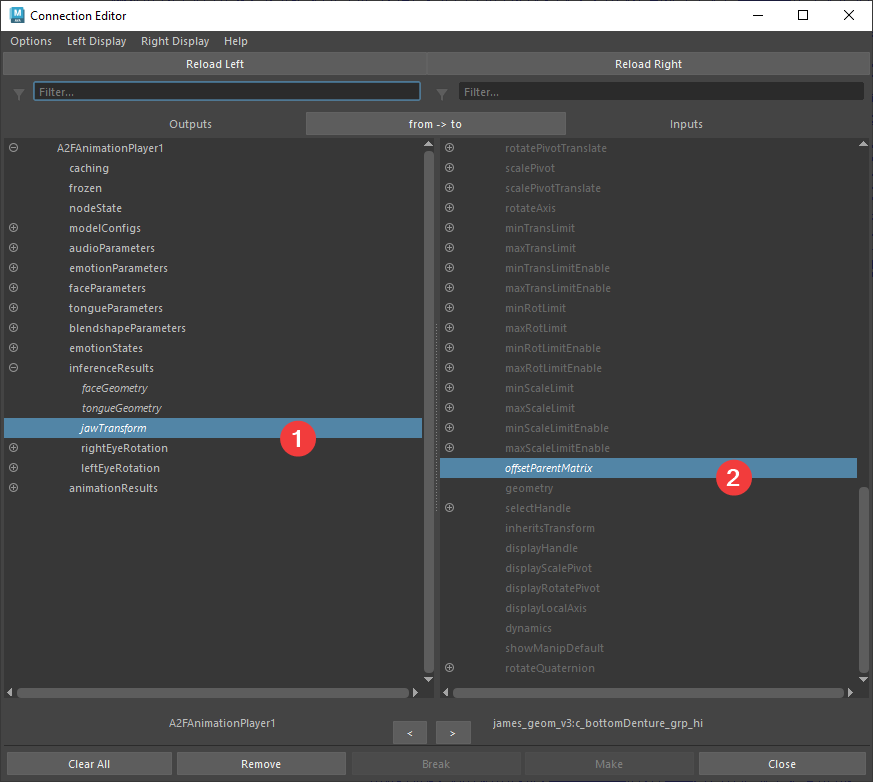
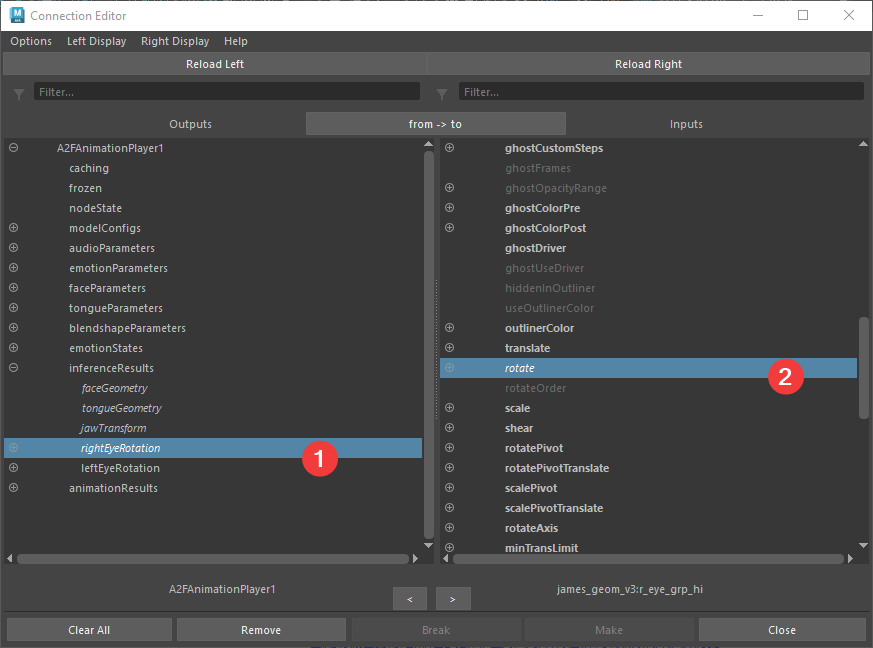
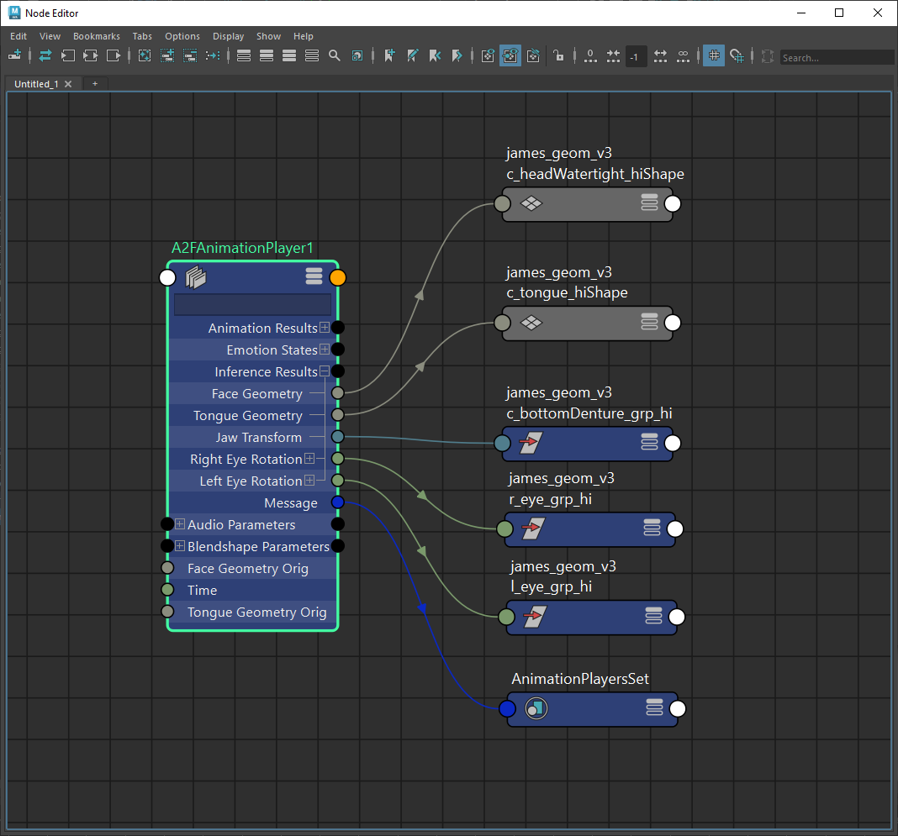

# User Guide - Audio2Face-3D Local Inference

## Table of Contents

- [Prepare to Use](#prepare-to-use)
- [Setting Up A2F Animation Player on Blendshapes](#setting-up-a2f-animation-player-on-blendshapes)
- [Setting Up A2F Animation Player for the Geometry Output](#setting-up-a2f-animation-player-for-the-inference-geometry-output)
- [Setting Up ACE Animation Player on Blendshapes](#setting-up-ace-animation-player-on-blendshapes)

## Prepare to Use

1. [Install the Plugin](prerequisites.md#install-the-plugin)
2. [Download the Sample Project](prerequisites.md#download-the-sample-project)
3. [Download AI Models](prerequisites.md#download-ai-models) and [Build TRT Engines](prerequisites.md#build-trt-engines) (For A2F Local Inference)
4. [Prepare Access to the Service](prerequisites.md#prepare-access-to-the-service) (For ACE Service)

### Configure Maya and Set Project

1. Launch Maya and set the **project** to the [sample project](../sample_project) directory
 
    - Open Maya and select `File -> Set Project`
    - Select the sample project directory
    - Click `OK`

2. Disable `Cached Playback` on the Time Slider
 
    - Maya-ACE v2.0+ works with Cached Playback, but it is recommended to disable this feature during initial testing.

3. Load the Maya plugin: `maya_ace`
     

4. [Import audio into the Maya scene](https://help.autodesk.com/view/MAYAUL/2024/ENU/?guid=GUID-CF2B0358-6946-4C9D-9F8C-A783921CAECC) and set it to the Time Slider sound.
     
    - Use one of the sample audios; [English(male)](../sample_project/sound/english_voice_male_p1_neutral.wav) or [Chinese(female)](../sample_project/sound/chinese_voice_female_p01_neutral.wav).

5. Check and adjust [Time Slider preferences](https://help.autodesk.com/view/MAYAUL/2024/ENU/?guid=GUID-51A80586-9EEA-43A4-AA1F-BF1370C24A64): framerate=**60**, playback speed=**60fps**, looping=once
 

## Setting Up A2F Animation Player on Blendshapes

> ### Managing Blendshape Names and Order
>
> Proper management of blendshape names and their order is essential
> for connecting the AceAnimationPlayer node in Maya-ACE to blendshape nodes effectively.
> For custom asset connections, refer to the
> [Connecting Custom Blendshapes](./bestpractices.md#connecting-custom-blendshapes) guide.
> To achieve optimal facial performance, it’s recommended to adhere to ARKit specifications
> for naming conventions and structure.

### Download an Asset and Import it

1. Finish [Preparation](#prepare-to-use) to follow the steps below.

1. Download the sample Maya files. We will use the [`james_arkit_v3.ma`](../sample_project/maya_blendshape_v3/james_arkit_v3.ma) in this instruction.
    - For more information, please refer to the [sample data explanation](../sample_project/README.md#face-assets).

2. Reference or Import the sample blendshape asset.
     

### Create an A2FAnimationPlayer on the Blendshapes

1. Select all mesh nodes of the asset including the face(`c_headWatertight_hi`), and click `menu->ACE/A2F->Create->A2F Player on Blendshapes`
     
    - (Tip) To optimize the viewport for faces, set up a viewport camera with focal length between **75mm** and **150mm** looking at the face(s)

### Configure the A2FAnimationPlayer

1. Open Attribute Editor and select `A2FAnimationPlayer1` node
     

1. [Build TRT engines](./gettingstarted-a2f.md#build-trt-engines) if not built yet.
     

1. Select `Audio2Face-3D v3.0` and `Audio2Emotion v2.2` models to use, or select the models you want to use.
     
    - NOTE: If you are in a region where Audio2Emotion is not available, please change the Audio2Emotion model to `Disable`.
     
    - Also select `Identity` (e.g. `Claire`) when using Audio2Face-3D v3.0 model.
     

1. Select an audio file from the `Audio File` option, if not set yet.
 
    - (Optional) Click `Update Time Slider` button to adjust the Time Slider audio and fit frame range.
     

1. Click Maya's play button. Check animation of the face.
 

### Connect the A2FAnimationPlayer to Other Blendshapes

Though Audio2Face produces the best results when it is used with the matching blendshape asset, it is a typical practice to connect to other blendshapes. Maya ACE connects blendshapes with names by default, and it is recommended to use blendshapes with matching pose names.

1. Reference another asset to the scene. For example, `claire_arkit_v3.ma`

1. Select both `A2FAnimationPlayer1` and `c_headWatertight_hi` of the Claire group in order,
and click `menu->ACE/A2F->Modify->Connect Player to Blendshapes`
 

1. Click Maya's play button again. Check animation on both faces.
 

## Setting Up A2F Animation Player for the Inference Geometry Output

### Download the Asset and Import it

1. Finish [Preparation](#prepare-to-use) to follow the steps below.

1. Download the sample geometry Maya files. We will use the [`james_geom_v3.ma`](../sample_project/maya_geom/james_geom_v3.ma) in this instruction.
    - For more information, please refer to the [sample data explanation](../sample_project/README.md#face-assets).

1. Import or Open a sample geometry asset. For example, `james_geom_v3.ma`.
     

### Create an A2FAnimationPlayer on the Mesh

1. Select the face mesh node(`c_headWatertight_hi`), and click `menu->ACE/A2F->Create->A2F Player on Mesh`
     

1. The face will disappear, and it is normal. We need to set models to see the face again.
     

### Configure the A2FAnimationPlayer for the Geometry Output

1. Open Attribute Editor and select `A2FAnimationPlayer1` node
     

1. [Build TRT engines](./gettingstarted-a2f.md#build-trt-engines) if not built yet.
     

1. Select `Audio2Face-3D v3.0` and `Audio2Emotion v2.2` models to use, or select the models you want to use.
     
    - NOTE: If you are in a region where Audio2Emotion is not available, please change the Audio2Emotion model to `Disable`.
     
    - Also select `Identity` (e.g. `Claire`) when using Audio2Face-3D v3.0 model.
     

1. Select an audio file from the `Audio File` option, if not set yet.
 
    - (Optional) Click `Update Time Slider` button to adjust the Time Slider audio and fit frame range.
     

1. Click Maya's play button. Check animation of the face. Teeth and eyes won't move yet, and we will set this in the next step.

### Connect the A2FAnimationPlayer to Other Components

A2FAnimationPlayer raw output includes face, tongue, jaw, and eye transforms. We will connect to these components to finish the full face setup.

#### Connect the Tongue Geometry

1. Select `A2FAnimationPlayer1` and `c_tongue_hi`.

1. Click `menu->ACE/A2F->Modify->Connect A2F Player to Tongue Mesh`.
 

#### Connect Jaw and Eye Transforms

1. Select `A2FAnimationPlayer1` and `c_bottomDenture_grp_hi`.

1. Open the `Connection Editor` through `menu->Windows->General Editors->Connection Editor`.

1. Expand `inferenceResults` on the left panel. Click `jawTransform` on the left, and click `offsetParentMatrix` on the right.
 

1. Select `r_eye_grp_hi` on the outliner. Click `Reload Right` on the Connection Editor.

1. Click `rightEyeRotation` on the left, and click `rotate` on the right.
 

1. Select `l_eye_grp_hi` on the outliner. Click `Reload Right` on the Connection Editor.

1. Click `leftEyeRotation` on the left, and click `rotate` on the right.

1. Check all the connections are set. `menu->Windows->Node Editor` can be used.
 

1. Click Maya's play button. Check animation of the face and all the components.
 

## Setting Up ACE Animation Player on Blendshapes

> ### Managing Blendshape Names and Order
>
> Proper management of blendshape names and their order is essential
> for connecting the AceAnimationPlayer node in Maya-ACE to blendshape nodes effectively.
> For custom asset connections, refer to the
> [Connecting Custom Blendshapes](./bestpractices.md#connecting-custom-blendshapes) guide.
> To achieve optimal facial performance, it’s recommended to adhere to ARKit specifications
> for naming conventions and structure.

### Download the Asset and Import it

1. Finish [Preparation](#prepare-to-use) to follow the steps below.

1. Download the sample Maya files.
We will use the [`james_arkit_v2.ma`](../sample_project/maya_blendshape_v2/james_arkit_v2.ma)
and [`claire_arkit_v2_topo1.ma`](../sample_project/maya_blendshape_v2/claire_arkit_v2_topo1.ma)
in this instruction.
    - For more information, please refer to the [sample data explanation](../sample_project/README.md#face-assets).
    - To see the best results, please use the [Blendshape v2 assets](../sample_project/maya_blendshape_v2) to connect to the Audio2Face-3D v1.3 service.

1. Create references of the assets, or import them.
     
    - Tip: type `f` to focus on the selected object, if you cannot see it.
    - Tip: adjust positions of `joint1` when using multiple faces in one scene.

### Create an AceAnimationPlayer on the Face

1. Select the `neutral` node of any asset and click `menu->ACE/A2F->Create->ACE Player on Blendshapes`
     

### Configure the AceAnimationPlayer and Get Animation

1. Select the `AceAnimationPlayer1` node and open the Attribute Editor
    - Tip 1: You can expand `AnimationPlayerSet` on the outliner and then select `AceAnimationPlayer1`.
     
    - Tip 2: You may turn off **DAG Objects only** from the Display menu to see AceAnimationPlayer1 in the outliner window.
     
    - Tip 3: To open the Attribute Editor, click menu -> Windows -> General Editors -> Attribute Editor
     

2. Check the option menu next to the Audio File attribute and select the imported audio if not set.
 
    - Click the `Update Time Slider` button to adjust the Time Slider range to fit the audio length, or manually adjust the Time Slider range.
     

3. Click the `Request New Animation` button and wait for the **Received ### frames** message.

4. The circle on the right of the button will change color to green if the communication was successful.
 

5. Click Maya's play button. Watch how the face is moving.
 

### Connect the AceAnimationPlayer to Another Face

1. Select both `AceAnimationPlayer1` and the `neutral` node of the Claire group in order,
then click `menu->ACE/A2F->Modify->Connect Player to Blendshapes`
 

2. Click Maya's play button again. Check animation on both faces.
 
