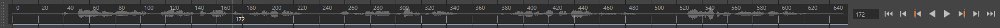
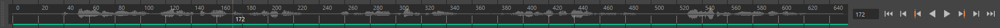
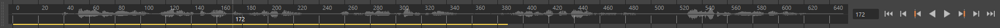
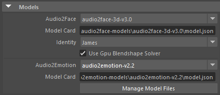
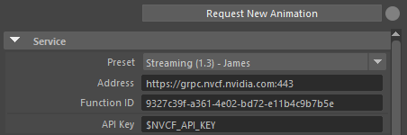
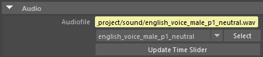

# User Interface

This guide provides a comprehensive overview of the Maya ACE plugin's user interface components and controls.

> **Overview**: The Maya ACE plugin provides two types of animation players. They are interchangeable in the workflow, but they have different controls for different features.
>
> - **A2F Player**: Local, offline animation generation using TensorRT engines (node type: A2FAnimationPlayer)
> - **ACE Player**: Network-based animation generation using Audio2Face-3D NIM services (node type: AceAnimationPlayer)

## Table of Contents

- [Compute Status - Time Slider Color](#compute-status---time-slider-color)
- [Attribute Editor](#attribute-editor)
  - [Models](#models)
  - [Service](#service)
  - [Audio](#audio)
  - [Emotion Parameters](#emotion-parameters)
  - [Face Parameters](#face-parameters)
  - [Tongue Parameters](#tongue-parameters)
  - [Blendshape Multipliers and Offsets](#blendshape-multipliers-and-offsets)
- [Main Menu](#main-menu)
- [TRT Manager Window](#trt-manager-window)

## Compute Status - Time Slider Color

A2F Players display their compute status through a colored line at the bottom of Maya's Time Slider. This visual indicator helps you track the progress of facial animation generation in real-time.

### Status Levels

A2F Players provide results in two levels for an interactive experience:

1. **Quick Preview**: Partial inference results for immediate feedback
2. **Full Result**: Complete inference results for final quality

### Status Colors

- **Grey**: Not started - No computation has begun
- **Green**: Success - Full inference complete, showing final results
- **Yellow**: In Progress - Computing, showing quick preview of partial results

> **Note**: When multiple players are active, the Time Slider displays the status of the most recently updated player.

<br />
<br />
<br />

## Attribute Editor

The Attribute Editor provides detailed controls for configuring and fine-tuning your Audio2Face-3D animation. Select an A2F Player or ACE Player node to access these parameters.

### Models

Configure the AI models used for facial animation and emotion generation. This section is available for A2F Players (local processing).

<br />

#### Audio2Face Model Settings

- **Audio2Face**: Select from available Audio2Face-3D models searched from the model paths.
- **Model Card (Audio2Face)**: Specify a custom path for the model card file outside the standard model directories.
- **Identity**: Choose a specific character identity (available in v3.x models).
- **Use GPU Blendshape Solver**: Enable GPU acceleration for better performance on blendshape output.

#### Audio2Emotion Model Settings

- **Audio2Emotion**: Select from available emotion detection models searched from the model paths.
- **Model Card (Audio2Emotion)**: Specify a custom path for the model card file outside the standard model directories.

#### Model Management

- **Manage Model Files**: Opens the TRT Manager window for model optimization and management

> **Tip**: Build TensorRT engines before first use for seamless experience.

### Service

Connect to the Audio2Face-3D NIM service to generate facial animations from audio input. This section is available for ACE Players.

<br />

#### Connection Controls

- **Request New Animation**: Send audio to the service and generate facial animation
- **Status Indicator**: Visual feedback for connection status
  -  **Green**: Successfully connected to service
  -  **Red**: Connection error or service unavailable
  -  **Yellow**: Connection outdated or needs refresh

#### Service Configuration

- **Preset**: Quick selection of predefined service configurations
- **API Key**: Your API key from the [Audio2Face-3D service page](https://build.nvidia.com/nvidia/audio2face-3d/api)
  - **Tip**: Use `$VARIABLE_NAME` to reference environment variables (e.g., `$NVCF_API_KEY`)
- **Address**: Service endpoint URL (e.g., `https://grpc.nvcf.nvidia.com:443`)
- **Function ID**: Model-specific identifier for the NVCF service
  - Find Function IDs on the [Audio2Face-3D service page](https://build.nvidia.com/nvidia/audio2face-3d/api)
  
  > **Example Function IDs** (as of June 13, 2025):
  > - Mark model (v1.3): `8efc55f5-6f00-424e-afe9-26212cd2c630`
  > - Claire model (v1.3): `0961a6da-fb9e-4f2e-8491-247e5fd7bf8d`
  > - James model (v1.3): `9327c39f-a361-4e02-bd72-e11b4c9b7b5e`

### Audio

Specify the audio input for facial animation generation.

<br />

- **Audio File**: Path to the audio file for animation generation
  - Select from imported audio files in the dropdown menu
  - Or enter a file path directly in the text field
  - **Supported formats**: WAV (see [Audio File Requirements](prerequisites.md#audio-file-requirements))

### Emotion Parameters

Audio2Face-3D combines AI-generated emotions with manual artistic control to create nuanced facial expressions. The system blends automatic emotion detection from audio with user-defined emotional states.

<br />

#### Overall Emotion Control

**Strength** (0.0-1.0): Master control for the intensity of final emotion

- Controls the overall emotional expressiveness of the character
- Acts as a multiplier for both generated and manual emotions

> **Formula**:
>
> ```text
> Final Emotion = Strength × [Weight × Preferred Emotion + (1 - Weight) × Generated Emotion]
> ```

#### Preferred (Manual) Emotion

Artist-driven emotional states that blend with or override AI-generated emotions.

- **Enable**: Toggle manual emotion control on/off
  - When disabled: 100% AI-generated emotions (still affected by Emotion Strength)
  - When enabled: Blends manual and generated emotions based on Weight
- **Weight** (0.0-1.0): Balance between manual and generated emotions
  - `0.0` = Pure AI-generated emotions
  - `0.5` = Equal blend of manual and generated
  - `1.0` = Pure manual emotions
- **Emotion Sliders**: Individual controls for each emotion type
  - **Range**: 0.0 (no emotion) to 1.0 (maximum intensity)

#### Auto Emotion (AI-Generated)

Fine-tune how the AI analyzes audio and generates emotional expressions.

- **Emotion Contrast** (0.1-3.0): Controls the "decisiveness" of emotion detection
  - Lower values: More neutral, balanced emotions
  - Higher values: Stronger, more distinct emotional peaks
  - **Technical note**: Adjusts the temperature parameter in the AI model
- **Smoothing** (0.0-1.0): Temporal smoothing for emotion transitions
  - Lower values: More responsive to quick emotional changes
  - Higher values: Smoother, more gradual emotional transitions
  - **Recommended**: Keep above 0.3 to avoid jarring emotion switches
- **Max Emotions** (1-6): Limit the number of active emotions
  - The AI detects all 6 emotions but only uses the strongest N emotions
  - **Example**: Setting to 2 keeps only the two most prominent emotions
  - **Use case**: Create more focused, less complex emotional states

### Face Parameters

Fine-tune various aspects of the facial animation to achieve the desired look and performance. These parameters affect how the AI interprets audio and generates facial movements.

<br />

- **Lower Face Smoothing** (0.0-0.1): Controls spatial blending and continuity of lower face movements for more natural transitions
- **Upper Face Smoothing** (0.0-0.1): Controls spatial blending and continuity of upper face movements for more natural transitions
- **Lower Face Strength** (0.0-2.0): Controls the amplitude and intensity of motion in the lower face region (jaw, mouth, and surrounding areas)
- **Upper Face Strength** (0.0-2.0): Controls the amplitude and intensity of motion in the upper face region (eyes, eyebrows, and forehead)
- **Face Mask Level** (0.0-1.0): Defines the vertical position of the boundary line that separates upper and lower face regions
- **Face Mask Softness** (0.001-0.5): Controls the smoothness of the transition zone between upper and lower face regions
- **Skin Strength** (0.0-2.0): Controls the overall amplitude of skin deformations and secondary movements
- **Eyelid Open Offset** (-1.0 to 1.0): Adjusts the default resting position of the eyelids
  - Positive values: Open eyelids more
  - Negative values: Close eyelids more
- **Lip Open Offset** (-0.2 to 0.2): Adjusts the default resting position of the lips
  - Positive values: Open lips more
  - Negative values: Close lips more

### Tongue Parameters

> **Note**: Tongue parameters are only available for A2F Player with supported models.

<br />

- **Tongue Strength** (0.0-2.0): Controls the amplitude and intensity of tongue movements during speech
- **Tongue Height Offset** (-3.0 to 3.0): Adjusts the baseline vertical position of the tongue
  - Positive values: Raise the tongue
  - Negative values: Lower the tongue
- **Tongue Depth Offset** (-3.0 to 3.0): Adjusts the baseline front-to-back position of the tongue
  - Positive values: Move tongue forward
  - Negative values: Move tongue back

### Blendshape Multipliers and Offsets

Apply per-blendshape adjustments to fine-tune or correct specific facial expressions. These controls allow artistic refinement of the AI-generated animation.

<br />

#### How It Works

Each blendshape value is modified using this formula:

> **Formula**:
>
> ```text
> Final Value = (Audio2Face-3D Result × Multiplier) + Offset
> ```

- **Multipliers**: Scale the intensity of specific expressions
  - **Values > 1.0**: Amplify the expression
  - **Values < 1.0**: Reduce the expression
  - **Value = 0**: Disable the expression entirely
- **Offsets**: Add constant values to expressions
  - **Positive values**: Add baseline activation
  - **Negative values**: Suppress the expression
  
> **Tip**: Use multipliers for dynamic adjustments and offsets for static corrections.

## Main Menu

Access Maya ACE tools and utilities from the main menu bar under **Audio2Face**.

> **Note**: All menu commands work with both A2F Players (local) and ACE Players (cloud), unless specifically noted.

<br />

### Create

#### ACE Player on Blendshape

Creates an AceAnimationPlayer node for cloud-based animation generation.

- **Selection**: Blendshape nodes or meshes with blendshapes
- **Use case**: Online animation with NVIDIA ACE services

#### A2F Player on Blendshape

Creates an A2FAnimationPlayer node for local animation generation.

- **Selection**: Blendshape nodes or meshes with blendshapes
- **Use case**: Offline animation with local TensorRT models

#### A2F Player on Mesh

Creates an A2FAnimationPlayer with direct mesh deformation.

- **Selection**: Polygon mesh with model compatible topology
- **Use case**: Characters without pre-existing blendshapes
- **Note**: Requires specific vertex count and topology

### Modify

#### Connect a Player to Blendshapes

Links an existing A2F/ACE player to new blendshape targets.

- **First selection**: AceAnimationPlayer or A2FAnimationPlayer node
- **Second selection**: Target blendshape nodes or meshes
- **Use case**: Reconnect animation to different objects or characters

### Config

#### Import A2F Parameters

Load saved animation settings from a configuration file.

- **Formats**: JSON or YAML
- **Target**: Selected A2F/ACE player node
- **Use case**: Apply consistent settings across scenes or share with team

#### Export A2F Parameters

Save current animation settings to a configuration file.

- **Format**: YAML
- **Source**: Selected A2F/ACE player node
- **Use case**: Backup settings or create presets

> **Important**: Exported parameters may not match server-side configurations exactly.
>
> - Only parameters controlled by the Maya plugin are exported (others use defaults)
> - Custom server deployments may have different default values
> - Always verify exported configurations against your server setup

#### Export A2F Service Configs

Retrieve configuration files directly from the Audio2Face-3D service (if supported by the service).

- **Source**: Connected Audio2Face-3D service
- **Use case**: Document service settings or migrate configurations

> **Note**: Service exports have limitations:
>
> - Format varies by service version
> - Some services may not support configuration export
> - Files are formatted for service deployment, not Maya plugin use

### Model

#### Open TRT Model Manager

Launch the TensorRT Model Manager for optimizing and managing AI models.

- **Function**: Build and manage TensorRT engine files
- **Models**: Audio2Face and Audio2Emotion models

## TRT Manager Window

The TensorRT (TRT) Manager optimizes AI models for real-time performance on your specific GPU hardware.

<br />

### Key Features

- **Model List**: View all available Audio2Face and Audio2Emotion models
- **Build TRT**: Optimize models for your GPU (one-time process per model)
- **Delete TRT**: Remove TensorRT engine files from the local storage

> **Performance Tip**: TensorRT engine files are GPU-specific. Rebuild when switching GPUs for optimal performance.

### Model Directory Management

Models can be stored in multiple locations for flexibility:

1. **Default Location**: `<maya_install>/modules/mace/models/`
   - Shared across all Maya projects

2. **Project Location**: `<project>/models/`
   - Project-specific models
   - Portable with project files

3. **Custom Locations**: Set via environment variables
   - `A2F_MODEL_DIRS`: Additional Audio2Face model directories
   - `A2E_MODEL_DIRS`: Additional Audio2Emotion model directories
   - Multiple directories supported (semicolon-separated on Windows)
   - See [environment variables guide](prerequisites.md#environment-variables)

### Advanced Optimization

For custom TensorRT optimization settings, modify the [build script](../source/maya_ace/scripts/trtgen/builder.py).

> **Note**: Advanced optimization requires understanding of TensorRT parameters and may affect model performance and accuracy.
